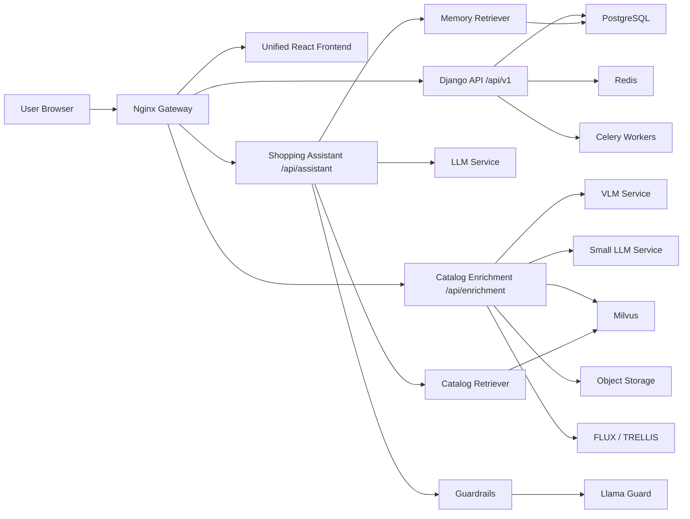

Copyright © 2026 Francis Banda.
All Rights Reserved.

This software and all associated intellectual property are proprietary and owned exclusively by Francis Banda.

Unauthorized copying, modification, distribution, sublicensing, resale, reverse engineering, or commercial use is prohibited without explicit written permission from Francis Banda.

# System Map

## Application Discovery

| App | Purpose | Technology | Status |
| --- | --- | --- | --- |
| App 1: `lingi7/` | Core Zambia marketplace with user accounts, products, orders, escrow, payments, fraud, logistics, disputes, notifications, admin audit, and unified React frontend | Django, DRF, PostgreSQL, Redis, Celery, SimpleJWT, React/Vite/TypeScript | Most complete; owns canonical business data and should remain the platform core |
| App 2: `enrichment/` | AI catalog enrichment: image-to-product fields, FAQs, policy compliance, manual extraction, image variation, 3D generation | FastAPI, Python, OpenAI-compatible model clients, Milvus/RAG, Next.js UI | Functional service boundary; frontend should be merged or embedded; needs stronger auth/upload controls |
| App 3: `assistant/` | AI shopping assistant with planning, retrieval, cart actions, memory, guardrails, streaming responses | FastAPI microservices, LangGraph, Milvus, Llama Guard, React UI | Good agent/service separation; needs identity integration and persistent memory tied to Django users |

## Communication Model

## Canonical Ownership

| Entity | Owner | Notes |
| --- | --- | --- |
| User, profile, KYC, roles | Django | SSO and permissions anchor |
| Product catalog | Django | Enrichment writes back through authenticated Django APIs |
| Orders, payments, escrow | Django | Financial state must not be duplicated in AI services |
| Notifications | Django | AI services publish notification intents to Django |
| Product vectors and policy vectors | Milvus | Store collection IDs and metadata in PostgreSQL |
| Conversation memory | Django/PostgreSQL | Assistant may cache/retrieve, but Django should own durable user-linked memory |
| Generated images/3D assets | Object storage | Django stores asset metadata and ownership |

## Target Gateway Routes

| Route | Target |
| --- | --- |
| `/api/v1/*` | Django REST API |
| `/health/` | Django dependency health check |
| `/api/enrichment/*` | Catalog enrichment FastAPI service |
| `/api/assistant/*` | Assistant chain server |
| `/enrichment/*` | Temporary enrichment frontend until merged |
| `/assistant/*` | Temporary assistant frontend until merged |
