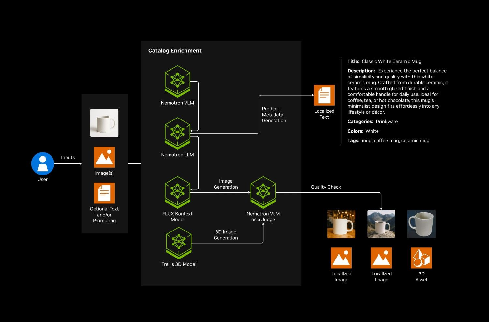

# Catalog Enrichment

A GenAI-powered catalog enrichment system that transforms basic product images into comprehensive, rich catalog entries using open-source models served locally via Ollama.

## Architecture



## Key Features

- **AI-Powered Analysis**: Qwen2-VL vision-language model for intelligent product understanding
- **Smart Categorization**: Automatic classification into predefined product categories
- **Intelligent Prompt Planning**: Context-aware image variation planning based on regional aesthetics
- **Multi-Language Support**: Generate product titles and descriptions in **10 regional locales**
- **Cultural Image Generation**: Create culturally-appropriate product backgrounds
- **Quality Evaluation**: Automated VLM-based quality assessment of generated images with detailed scoring
- **3D Asset Generation**: Transform 2D product images into interactive 3D GLB models using Microsoft TRELLIS
- **Product FAQ Generation**: Automatically generate product FAQs from enriched catalog data, with optional product manual PDF upload for richer FAQs via stateless targeted RAG
- **Policy Compliance**: Upload policy PDFs and automatically check product listings against them using RAG + Milvus
- **Protocol Schema Export**: Export enriched product data as ACP (Agentic Commerce Protocol) and UCP (Unified Commerce Protocol) compliant schemas with LLM-extracted structured attributes
- **Modular API**: Separate endpoints for VLM analysis, FAQ generation, image generation, 3D asset generation, and protocol schema export

## Documentation

- **[API Documentation](docs/API.md)** - Detailed API endpoints, parameters, and examples
- **[Docker Deployment Guide](docs/DOCKER.md)** - Docker and Docker Compose setup instructions
- **[Product Requirements (PRD)](docs/PRD.md)** - Product requirements and feature specifications
- **[Policy Compliance](docs/POLICY_COMPLIANCE.md)** - How policy compliance checking works
- **[Product Manual for FAQs](docs/PRODUCT_MANUAL_FAQS.md)** - How product manual PDFs enrich FAQ generation

## Tech Stack

**Backend:**
- FastAPI + Uvicorn
- Python 3.11+

**Frontend:**
- Next.js 15 with React 19
- TypeScript
- Kaizen UI (KUI) design system
- Model-viewer for 3D assets

**AI Models (all open source, served via Ollama):**
- Qwen2-VL-7B-Instruct (vision-language model)
- Meta-Llama-3.1-8B-Instruct (text generation, prompt planning)
- FLUX.1-Kontext-Dev (image generation)
- Microsoft TRELLIS (3D generation)
- BAAI/bge-small-en-v1.5 (embeddings for policy compliance)

**Infrastructure:**
- Docker & Docker Compose
- Ollama for model serving
- Milvus vector database for policy PDF retrieval

## Minimum System Requirements

| Model | Purpose | Minimum | Recommended |
|-------|---------|---------|-------------|
| Qwen2-VL-7B | Vision-Language Analysis | CPU (slow) | 1× GPU (16GB+) |
| LLaMA-3.1-8B | Text Generation | CPU (slow) | 1× GPU (16GB+) |
| BGE-small-en-v1.5 | Embeddings (Policy Compliance) | CPU | CPU |
| FLUX.1-Kontext-Dev | Image Generation | 1× GPU (24GB+) | 1× H100 |
| Microsoft TRELLIS | 3D Asset Generation | 1× GPU (24GB+) | 1× H100 |

**Note**: The core enrichment pipeline (VLM analysis, LLM enhancement, FAQs, protocol schemas) runs on CPU via Ollama, though inference is slower. Image generation (FLUX) and 3D generation (TRELLIS) require a GPU.

## Quick Start

### Prerequisites

- Python 3.11+
- [`uv`](https://docs.astral.sh/uv/) package manager
- Ollama running locally or in Docker
- HuggingFace token for FLUX image generation (optional)

### Environment Setup

Copy the example env file and fill in your keys:

```bash
cp .env.example .env
```

**Getting API Keys:**
- HuggingFace Token: [Get one here](https://huggingface.co/settings/tokens) (only needed for FLUX image generation)

### Local Development (Without Docker)

1. **Install uv** (if not already installed):
   ```bash
   curl -LsSf https://astral.sh/uv/install.sh | sh
   ```

2. **Create and activate virtual environment**:
   ```bash
   uv venv .venv
   source .venv/bin/activate  # On Windows: .venv\Scripts\activate
   ```

3. **Install dependencies**:
   ```bash
   uv pip install -e .
   ```

4. **Pull Ollama models**:
   ```bash
   ollama pull qwen2.5:7b        # For text generation (LLM)
   ollama pull llava:7b           # For vision analysis (VLM)
   ```

5. **Configure model endpoints**:
   
   Update the URLs in `shared/config/config.yaml` to point to your local Ollama instance:
   
   ```yaml
   vlm:
     url: "http://localhost:11434/v1"
     model: "llava:7b"
   
   llm:
     url: "http://localhost:11434/v1"
     model: "qwen2.5:7b"
   
   flux:
     url: "http://localhost:8003/v1/infer"
   
   trellis:
     url: "http://localhost:8004/v1/infer"
   
   embeddings:
     url: "http://localhost:8005/v1"
     model: "BAAI/bge-small-en-v1.5"
   ```

6. **Run the backend**:
   ```bash
   uvicorn --app-dir src backend.main:app --host 0.0.0.0 --port 8000 --reload
   ```

7. **Run the frontend** (optional):
   ```bash
   cd src/ui
   pnpm install
   pnpm dev
   ```

The frontend at `http://localhost:3000`.

### Docker Deployment

The Docker deployment includes Ollama containers for VLM and LLM, plus a custom embeddings server. If you want to use uploaded policy PDFs in the UI, start the companion Milvus stack from `docker-compose.rag.yml` as well.

**Quick Docker Start:**

1. **Create `.env` file** with required credentials:
   ```bash
   API_KEY=ollama
   HF_TOKEN=your_huggingface_token_here  # Only needed for FLUX
   ```

2. **Create the shared Docker network**:
   ```bash
   docker network create catalog-network || true
   ```

3. **Start the policy RAG stack** (optional, for policy compliance):
   ```bash
   docker compose -f docker-compose.rag.yml up -d
   ```

4. **Start the application stack**:
   ```bash
   docker compose up -d
   ```

5. **Access the application**:
   - Frontend: `http://localhost:3000`
   - Backend API: `http://localhost:8000`
   - Health Check: `http://localhost:8000/health`
   - Milvus: `localhost:19530`
   - MinIO Console: `http://localhost:9001`

## API Endpoints

The system provides the following endpoints:

- `POST /vlm/analyze` - Fast VLM/LLM analysis
- `POST /vlm/faqs` - Product FAQ generation (supports optional manual knowledge)
- `POST /vlm/manual/extract` - Extract knowledge from a product manual PDF for FAQ enrichment
- `POST /generate/variation` - Image generation with FLUX
- `POST /generate/3d` - 3D asset generation with TRELLIS
- `POST /protocols/generate` - ACP & UCP protocol schema generation

### Image Input Guidance

- **Recommended image size**: For best results, use product images that are ideally **500x500 pixels or higher** (JPEG or PNG).

For detailed API documentation with request/response examples, see **[API Documentation](docs/API.md)**.

## Integration with Lingi7

This enrichment app is designed to integrate with the Lingi7 Django backend as an external service. The lingi7 backend proxies enrichment requests through authenticated endpoints under `/api/v1/products/enrichment-workbench/*`, providing JWT auth, vendor ownership checks, and automatic product data attachment.

When deployed together, the enrichment backend runs as a separate Docker service accessible to the lingi7 Django app via the Docker network.

## License

Apache License 2.0
